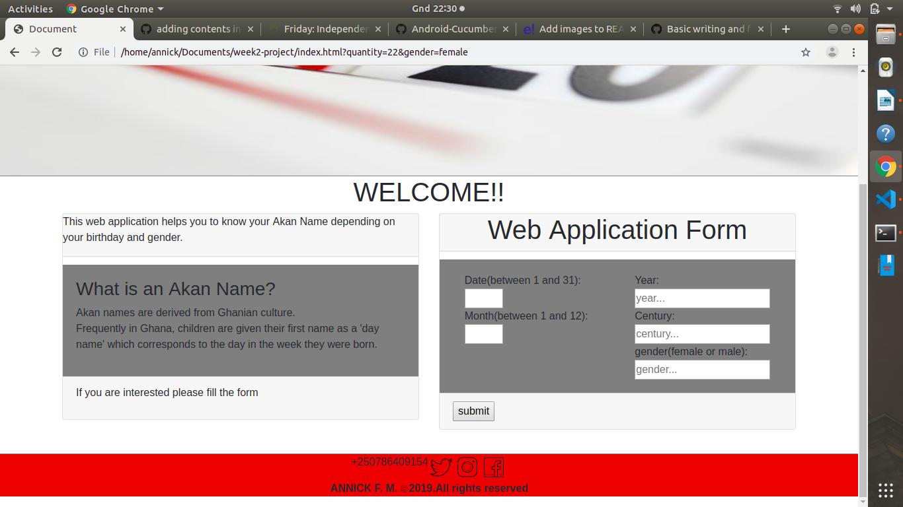

# week2-project
 Akan Name finder
## Akan name finder
 This project is a web application that helps to know the Akan Name depending on the birthday and gender.
 The Akan Name originates from Ghanian culture.Children are given their first name as a 'day name' which corresponds to the day in the week they were born.
 ## Author's Name
 Annick Francine MAJYAMBERE 
 A new web-developer
  ## Setup instructions
  -First read the use or function of the web application.
  -If interested please start to fill the form.
  -After you filling the form you would be given the result including the day you were born on and the name corresponding to it
  ### BDD
  
  user interface                | manupulation                                       | Output
  ------------------------------|----------------------------------------------------|--------------------
  Entering the user needed info |storing them into variables use them for calculation|Getting the results
   
   
   #### Technologies used
   -HTML
   -CSS Styling
   -Bootstrap
   -Javascript
   
   ### Contact information
    Phone number=+250786409154
    Email:mfannick1@gmail.com

  ### License and Copyright information
   &copy;        