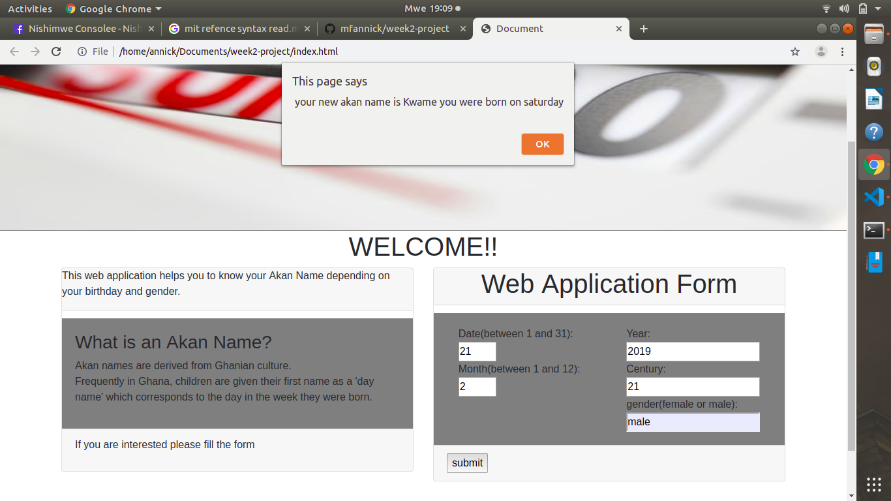

# week2-project
 Akan Name finder
## Akan name finder
 This project is a web application that helps to know the Akan Name depending on the birthday and gender.
 The Akan Name originates from Ghanian culture.Children are given their first name as a 'day name' which corresponds to the day in the week they were born.
 ## Author's Name
 Annick Francine MAJYAMBERE 
 A new web-developer
  ## Setup instructions
  
  -First read the use or function of the web application.
  -If interested please start to fill the form.
  -After you filling the form you would be given the result including the day you were born on and the name corresponding to it

  ### BDD
  
  
  <!-- user interface                | manupulation                                       | Output
  ------------------------------|----------------------------------------------------|--------------------
  Entering the user needed info |storing them into variables use them for calculation|Getting the results -->

  | Command | Description | Output |
  | --- | --- |-----|
  | Entering the user needed info  | storing them into variables use them for calculation | Getting the results 
  <!-- | git diff | Show file differences that haven't been staged | -->
   
   
   #### Technologies used

     -HTML
     -CSS Styling
     -Bootstrap
     -Javascript
   
   ### Contact information
    
    Phone number=+250786409154
    Email:mfannick1@gmail.com

  ### MIT License and Copyright information
   

  Copyright &copy; [2019] [Annick-Francine-M]
  
Permission is hereby granted, free of charge, to any person obtaining a copy
of this software and associated documentation files (the "Software"), to deal
in the Software without restriction, including without limitation the rights
to use, copy, modify, merge, publish, distribute, sublicense, and/or sell
copies of the Software, and to permit persons to whom the Software is
furnished to do so, subject to the following conditions:

The above copyright notice and this permission notice shall be included in all
copies or substantial portions of the Software.

THE SOFTWARE IS PROVIDED "AS IS", WITHOUT WARRANTY OF ANY KIND, EXPRESS OR
IMPLIED, INCLUDING BUT NOT LIMITED TO THE WARRANTIES OF MERCHANTABILITY,
FITNESS FOR A PARTICULAR PURPOSE AND NONINFRINGEMENT. IN NO EVENT SHALL THE
AUTHORS OR COPYRIGHT HOLDERS BE LIABLE FOR ANY CLAIM, DAMAGES OR OTHER
LIABILITY, WHETHER IN AN ACTION OF CONTRACT, TORT OR OTHERWISE, ARISING FROM,
OUT OF OR IN CONNECTION WITH THE SOFTWARE OR THE USE OR OTHER DEALINGS IN THE
SOFTWARE.   